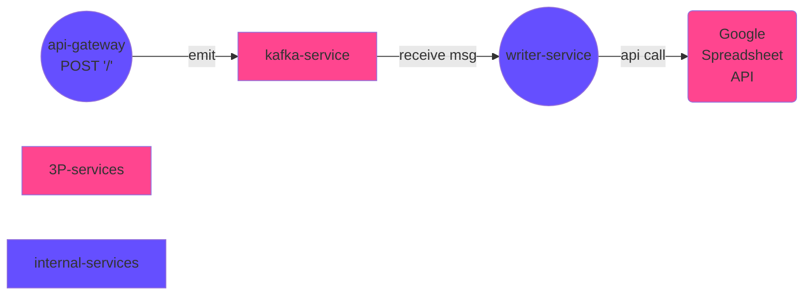

<p align="center">
  <a href="http://nestjs.com/" target="blank"></a>
</p>

## Google Spreadsheet Writer

This project implements a **Google Spreadsheet** writer using [Nest](https://github.com/nestjs/nest) framework with **Kafka** as our transport layer and **Docker** +  **docker-compose** for provisioning our services.

You can see the *output spreadsheet* [here](https://docs.google.com/spreadsheets/d/1EPsPGMzc_lInQ8CdePUh4rgCLMWOfxFoHcLlfc_Cjl8/edit?usp=sharing).

### Services diagram



The diagram above reflects the architecture of this project.

It has an *api-gateway* which *emits* events to *Kafka*, our transport layer.

We also have a *writer-service* listening kafka messages on the same topic that *api-gateway* is emitting events. The writer service will parse messages and then publish it to a given *Google Spreadsheet*, which can be specified inside the `.env`.

As we'll have a few services, I choose to create a **[Nest.js Monorepo](https://docs.nestjs.com/cli/monorepo)** to separate each service implementation.

## Dependencies

To run this project you'll need to have the following items to your computer:

- `nodejs`
- `pnpm` - package manager used to develop this project
- `docker` and `docker-compose` - to provisioning the development environment
- `ansible-vault` (optional) - used to decrypt the `.env` credentials

## Credentials

To run this project you need to have a `.env` file with the following credentials:

```shell
# your .env file
GOOGLE_PRIVATE_KEY="****"
GOOGLE_SERVICE_ACCOUNT_EMAIL="****"
GOOGLE_PRIVATE_SPREADSHEET_ID="****"
```

> **Note**:
>
> You also need to invite the application's email to your spreadsheet.
> Check more details [here](https://theoephraim.github.io/node-google-spreadsheet/#/getting-started/authentication?id=service-account).

If you have the **credentials password**, just decrypt the `.env.encrypted` file to generate my development credentials by running `pnpm decrypt` and inputting the password.

## Usage

This project offers a few handy commands that will help you run and test it.

> **Warning**:
>
> This project is not meant to run **outside docker** as the network hostname are manually defined.

The following commands are available:

```bash
# Docker commands
pnpm d:up     # alias to docker-compose up
pnpm d:down   # alias to docker-compose down
pnpm d:logs   # alias to docker-compose logs
pnpm d:exec   # alias to docker-compose exec (debug)

# Useful commands
pnpm fmt      # format files
pnpm lint     # lint projects
pnpm decrypt  # decrypt .env

# Running tests
pnpm tests api-gateway
pnpm tests writer
```

## Implementation Details

I started the project implementing a [standalone](https://docs.nestjs.com/standalone-applications) Nest.js API that receives a payload, validates it and parse into a CSV.

After finishing this first step, I decided to turn the project into a [monorepo](https://docs.nestjs.com/cli/monorepo), splitting the code into *api-gateway* and *writer* service. These services were communicating initially via TCP.

When I got it working, the next step was to configure kafka, so it was time to containerize the project!

Before even think of integrating kafka, I struggled a little bit with the network "wiring". Nest.js services usually communicates using the hostname `localhost`, but, as I was running multiple containers apps using `docker-compose`, each service has a different hostname (e.g. `api-gateway`, `writer`, `kafka`, so on). I fixed it adjusting the initial TCP setup to use the new hostname.

Great! The app is containerized, now it's time to configure kafka. I used the `bitnami/kafka` image, which also requires a `zookeeper` instance. Kafka uses it to store and manage metadata information about Kafka clusters, and also manage and organize kafka brokers (servers).

After configuring zookeeper and kafka, I needed to configure the Nest.js transport layer to use kafka and refactor the code for connecting on it.

The only part missing now was the Google Spreadsheet integration. I did some research on that and found an interesting library called [`google-spreadsheet`](https://www.npmjs.com/package/google-spreadsheet). I had to create a factory for injecting it as dependency of the `SpreadsheetService`, responsible for adding a row on the specified spreadsheet.

The `GOOGLE_PRIVATE_SPREADSHEET_ID` environment variable can be defined in `.env`. This is the same ID used on the Spreadsheet URL. You also need to invite the `GOOGLE_SERVICE_ACCOUNT_EMAIL` the created spreadsheet - [how to configure google service credentials](https://theoephraim.github.io/node-google-spreadsheet/#/getting-started/authentication?id=service-account).

## Next Steps

- [ ] more constants
- [ ] docker for production
- [ ] docker for running e2e tests
- [ ] create CI/CD pipelines

## Stay in touch

- Author - [Marco Antônio](https://www.linkedin.com/in/masouzajunior/)
- Website - <https://marco.tremtec.com>

## References

- Nest.js docs - <https://docs.nestjs.com/>
- Nest.js Monorepo - <https://docs.nestjs.com/cli/monorepo>
- Nest.js Standalone Apps - <https://docs.nestjs.com/standalone-applications>
- Kafka image - <https://hub.docker.com/r/bitnami/kafka/>
- ZooKeeper image - <https://hub.docker.com/r/bitnami/zookeeper/>
- Google credentials setup - <https://theoephraim.github.io/node-google-spreadsheet/#/getting-started/authentication?id=service-account>
