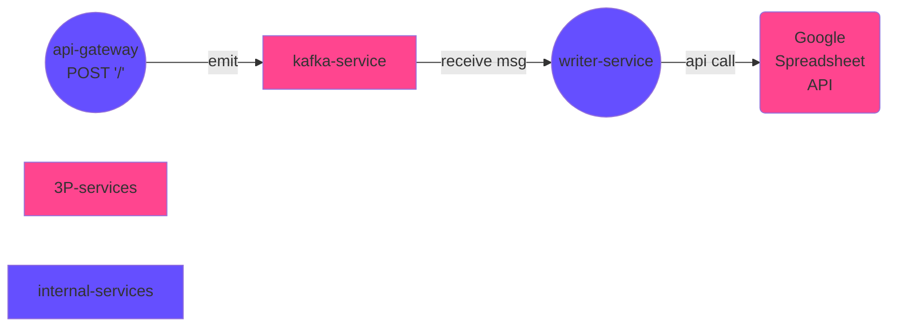

<p align="center">
  <a href="http://nestjs.com/" target="blank"></a>
</p>

## Google Spreadsheet Writer

This project implements a **Google Spreadsheet** writer using [Nest](https://github.com/nestjs/nest) framework with **Kafka** as our transport layer and **Docker** +  **docker-compose** for provisioning our services.

You can see the *output spreadsheet* [here](https://docs.google.com/spreadsheets/d/1EPsPGMzc_lInQ8CdePUh4rgCLMWOfxFoHcLlfc_Cjl8/edit?usp=sharing).

### Services diagram



The diagram above reflects the architecture of this project.

It has an *api-gateway* which *emits* events to *Kafka*, our transport layer.

We also have a *writer-service* listening kafka messages on the same topic that *api-gateway* is emitting events. The writer service will parse messages and then publish it to a given *Google Spreadsheet*, which can be specified inside the `.env`.

As we'll have a few services, I choose to create a **[Nest.js Monorepo](https://docs.nestjs.com/cli/monorepo)** to separate each service implementation.

## Dependencies

To run this project you'll need to have the following items to your computer:

- `nodejs`
- `pnpm` - package manager used to develop this project
- `docker` and `docker-compose` - to provisioning the development environment
- `ansible-vault` (optional) - used to decrypt the `.env` credentials

## Credentials

To run this project you need to have a `.env` file with the following credentials:

```shell
# your .env file
GOOGLE_PRIVATE_KEY="****"
GOOGLE_SERVICE_ACCOUNT_EMAIL="****"
GOOGLE_PRIVATE_SPREADSHEET_ID="****"
```

> **Note**:
>
> You also need to invite the application's email to your spreadsheet.
> Check more details [here](https://theoephraim.github.io/node-google-spreadsheet/#/getting-started/authentication?id=service-account).

If you have the **credentials password**, just decrypt the `.env.encrypted` file to generate my development credentials by running `pnpm decrypt` and inputting the password.

## Usage

This project offers a few handy commands that will help you run and test it.

> **Warning**:
>
> This project is not meant to run out of docker, as it manually sets network details that will not work out of docker

The following commands are available:

```bash
# Docker commands
pnpm d:up     # alias to docker-compose up
pnpm d:down   # alias to docker-compose down
pnpm d:logs   # alias to docker-compose logs
pnpm d:exec   # alias to docker-compose exec (debug)

# Useful commands
pnpm fmt      # format files
pnpm lint     # lint projects
pnpm decrypt  # decrypt .env

# Running tests
pnpm tests api-gateway
pnpm tests writer
```

## Implementation Details

> TBD

## Next Steps

> TBD

## Stay in touch

- Author - [Marco Antônio](https://www.linkedin.com/in/masouzajunior/)
- Website - <https://marco.tremtec.com>

## References

> TBD

## To Document

- [x] Description
  - [x] Monorepo
  - [x] Diagram
  - [x] No reply after emit
- [x] Dependencies
  - [x] `docker`
  - [x] `docker-compose`
  - [x] `ansible-vault`
- [x] Usage
  - [x] Setup Google Credentials
- [ ] Implementation details
  - [ ] Docker + kafka + microservice
  - [ ] kafka + zookeeper
  - [ ] GoogleSpreadsheet lib
- [ ] Next steps
  - [ ] more constants
  - [ ] docker for production
  - [ ] docker for running e2e tests
  - [ ] create CI/CD pipelines

